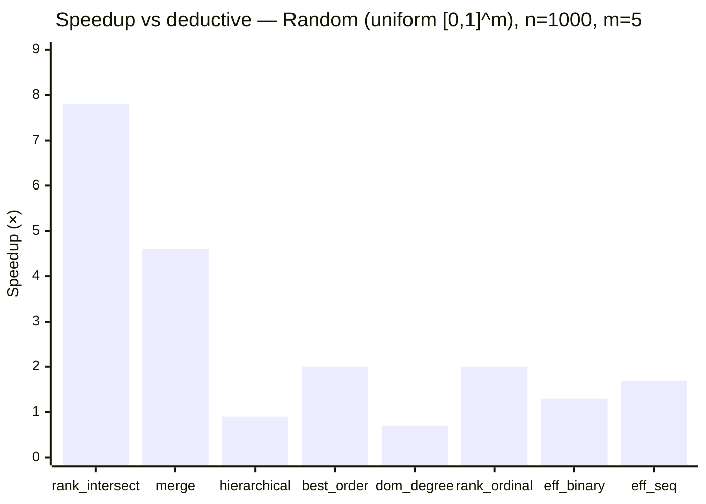
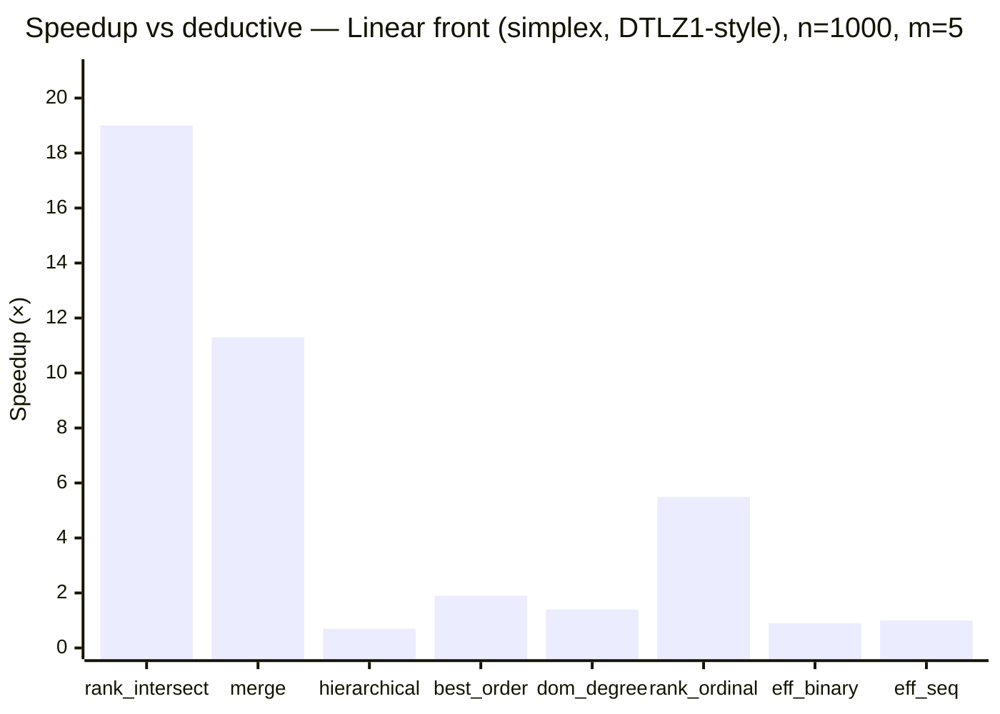
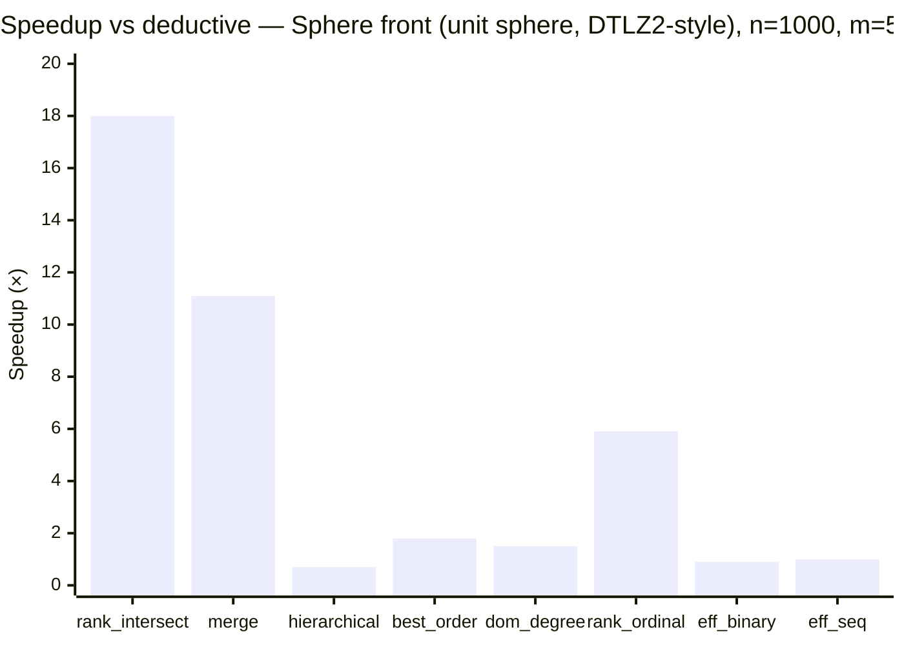
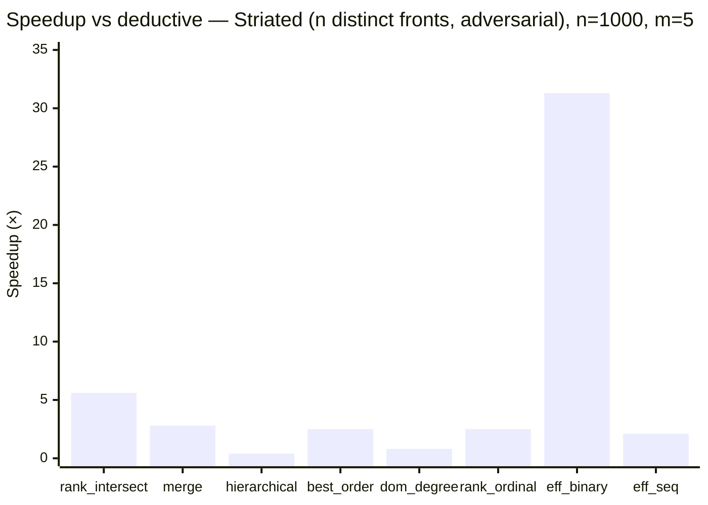
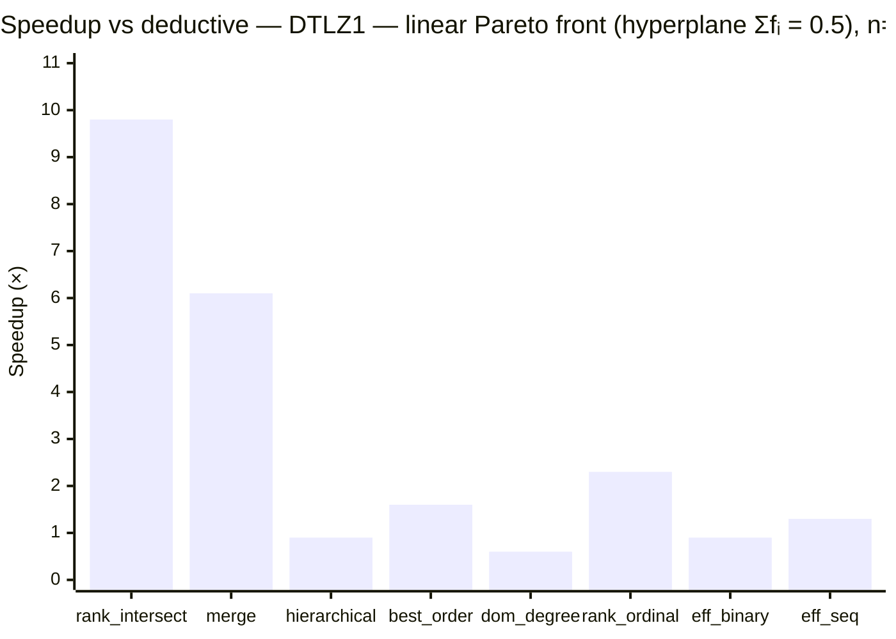
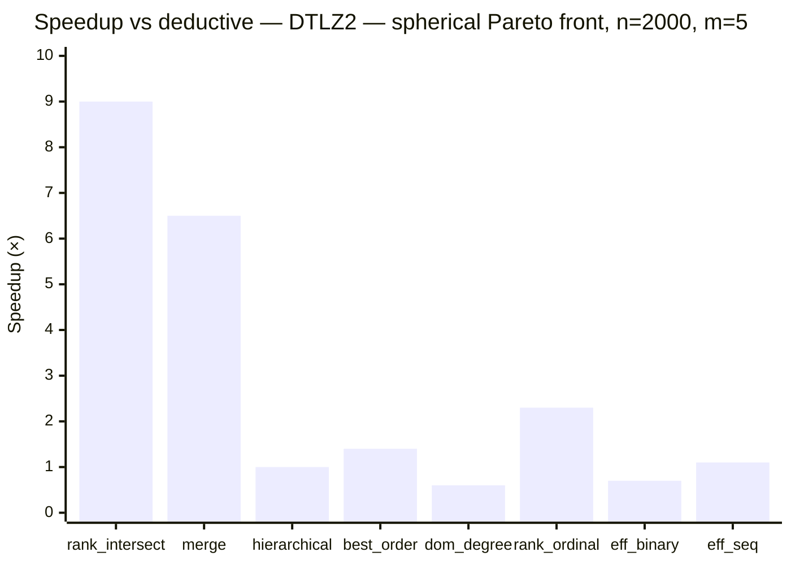
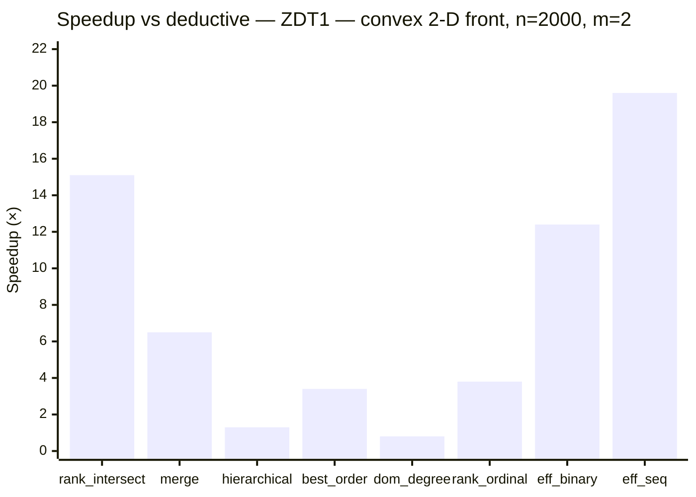
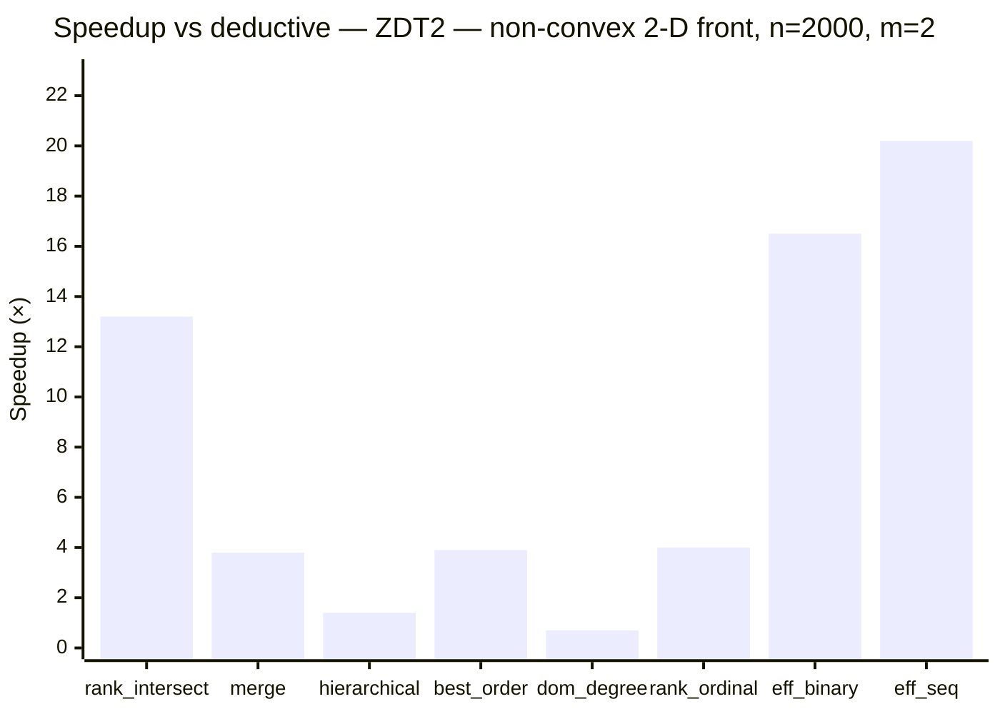

# Benchmarks

Times are wall-clock **µs/sort** (one full population ranking).
The fastest sorter per row is **bold**. Entries with >2 % MAPE are marked \*.

## Environment

<!-- Fill in before committing: CPU, compiler, flags, any relevant notes. -->

## Sorters

| Short name | Algorithm | Complexity (best / worst) | Reference |
|:---|:---|:---|:---|
| `deductive` | Deductive sort | O(MN²) expected / Θ(MN³) | [Mishra & Buzdalov, GECCO 2020](https://doi.org/10.1145/3377930.3390246) |
| `rank_intersect` | Rank-intersect NDS — packed triangular bitsets, SIMD intersection, rank propagation | O(MN log N) avg / O(MN²) | [Burlacu, arXiv 2022](https://arxiv.org/abs/2203.13654) |
| `merge` | Merge NDS (MNDS) | O(N log N) best / O(MN²) | [Moreno et al., IEEE TCYB 2020](https://doi.org/10.1109/TCYB.2020.2968301) |
| `hierarchical` | Hierarchical NDS (HNDS) | O(MN√N) best / O(MN²) | [Bao et al., J. Comput. Sci. 2017](https://doi.org/10.1016/j.jocs.2017.09.015) |
| `best_order` | Best Order Sort (BOS) | O(MN log N) best / O(MN²) | [Roy et al., GECCO 2016](https://doi.org/10.1145/2908961.2931684) |
| `dom_degree` | Dominance degree sort — degree matrix + NSGA-II sweep | O(MN²) | [Zhou et al., IEEE TEC 2017](https://doi.org/10.1109/TEVC.2016.2567648) |
| `rank_ordinal` | Rank-ordinal sort — per-objective stable permutations, SIMD dominated check | O(MN log N + N²) | — |
| `eff_binary` | ENS-BS — efficient NDS, binary search (requires lex-sorted input) | O(MN log N) best / O(MN²) | [Zhang et al., IEEE TEC 2015](https://doi.org/10.1109/TEVC.2014.2308305) |
| `eff_seq` | ENS-SS — efficient NDS, sequential search (requires lex-sorted input) | O(MN√N) best / O(MN²) | [Zhang et al., IEEE TEC 2015](https://doi.org/10.1109/TEVC.2014.2308305) |

## Synthetic benchmarks

Four distributions covering the main cases from the literature
(Jensen 2003; Fortin & Parizeau 2013; Buzdalov & Shalyto 2014):

- **random** — uniform [0,1]^m; typical EA population.
- **linear\_front** — all points on the (m−1)-simplex (Σfᵢ = 1); DTLZ1-style converged front.
- **sphere\_front** — all points on the positive unit sphere; DTLZ2-style converged front.
- **striated** — individual i has fⱼ = i for all j; n distinct fronts; worst case for O(n·|F₀|) inner loops.

### Random (uniform [0,1]^m)

*All times in µs.*

| n | m | deductive | rank\_intersect | merge | hierarchical | best\_order | dom\_degree | rank\_ordinal | eff\_binary | eff\_seq |
| --: | --: | --: | --: | --: | --: | --: | --: | --: | --: | --: |
| 100 | 2 | 10.5 | 8.9 | 14.7 | 14.4 | 15.4 | 22.9 | 7.6 | **4.1** | 4.1 |
| 100 | 5 | 14.0 | 22.8 | 25.0 | 9.2 | 27.2 | 25.7 | 12.4 | 8.9 | **5.0** |
| 100 | 10 | 43.7 | 46.3 | 48.8 | 18.1 | 50.9 | 36.8 | 19.3 | 13.1 | **8.6** |
| 500 | 2 | 367.4 | 34.7 | 133.6 | 321.2 | 106.8 | 487.8 | 115.9 | 30.2 | **30.1** |
| 500 | 5 | 320.4 | **64.5** | 93.9 | 351.7 | 178.2 | 498.0 | 170.3 | 251.1 | 177.7 |
| 500 | 10 | 984.4 | **120.7** | 164.2 | 870.7 | 303.6 | 668.9 | 211.1 | 689.0 | 605.0 |
| 1000 | 2 | 1333.6 | 107.4 | 419.0 | 1023.3 | 372.9 | 1730.9 | 389.6 | 100.6 | **76.6** |
| 1000 | 5 | 1184.5 | **152.3** | 256.7 | 1293.5 | 602.3 | 1787.6 | 597.3 | 912.6 | 706.8 |
| 1000 | 10 | 3755.1 | **304.7** | 354.5 | 3093.6 | 957.7 | 2650.3 | 695.7 | 2659.9 | 2444.8 |

### Linear front (simplex, DTLZ1-style)

*All times in µs.*

| n | m | deductive | rank\_intersect | merge | hierarchical | best\_order | dom\_degree | rank\_ordinal | eff\_binary | eff\_seq |
| --: | --: | --: | --: | --: | --: | --: | --: | --: | --: | --: |
| 100 | 2 | 11.8 | 6.9 | 9.6 | 15.1 | 12.7 | 11.6 | 6.7 | 7.4 | **6.1** |
| 100 | 5 | 22.4 | 21.3 | 24.1 | 14.2 | 26.2 | 21.7 | 10.7 | 11.4 | **8.2** |
| 100 | 10 | 45.5 | 46.5 | 44.0 | 20.2 | 51.9 | 38.8 | 18.7 | 13.7 | **8.4** |
| 500 | 2 | 256.4 | **22.1** | 35.3 | 344.0 | 100.3 | 220.3 | 103.1 | 148.2 | 114.5 |
| 500 | 5 | 515.4 | **62.3** | 85.3 | 669.6 | 276.9 | 401.9 | 111.9 | 539.9 | 437.0 |
| 500 | 10 | 1078.7 | **117.1** | 156.7 | 875.7 | 282.9 | 658.4 | 164.4 | 704.6 | 632.4 |
| 1000 | 2 | 1004.9 | **45.3** | 68.6 | 1337.8 | 343.0 | 822.5 | 365.8 | 561.5 | 429.6 |
| 1000 | 5 | 2083.9 | **109.9** | 183.7 | 2786.4 | 1081.1 | 1439.1 | 380.0 | 2208.7 | 1995.7 |
| 1000 | 10 | 4411.9 | **269.4** | 338.5 | 3596.9 | 984.5 | 2793.9 | 486.7 | 2868.5 | 2823.0 |

### Sphere front (unit sphere, DTLZ2-style)

*All times in µs.*

| n | m | deductive | rank\_intersect | merge | hierarchical | best\_order | dom\_degree | rank\_ordinal | eff\_binary | eff\_seq |
| --: | --: | --: | --: | --: | --: | --: | --: | --: | --: | --: |
| 100 | 2 | 11.8 | 6.9 | 9.7 | 15.2 | 12.6 | 11.7 | 6.7 | 7.6 | **6.2** |
| 100 | 5 | 22.5 | 21.1 | 23.6 | 14.0 | 26.6 | 22.1 | 10.4 | 10.9 | **7.9** |
| 100 | 10 | 45.8 | 46.6 | 44.3 | 18.4 | 50.9 | 37.4 | 18.8 | 11.9 | **8.3** |
| 500 | 2 | 255.5 | **21.0** | 33.7 | 344.7 | 99.2 | 215.0 | 98.8 | 142.5 | 111.6 |
| 500 | 5 | 524.7 | **59.2** | 80.9 | 642.5 | 287.1 | 396.1 | 111.8 | 510.2 | 423.5 |
| 500 | 10 | 1112.5 | **118.0** | 156.1 | 892.4 | 296.4 | 676.6 | 167.2 | 693.0 | 633.5 |
| 1000 | 2 | 1005.2 | **44.7** | 67.8 | 1337.9 | 335.5 | 819.7 | 362.1 | 560.1 | 429.7 |
| 1000 | 5 | 2106.1 | **117.0** | 189.4 | 2816.7 | 1144.7 | 1446.7 | 354.7 | 2256.7 | 2054.0 |
| 1000 | 10 | 4423.7 | **267.3** | 338.8 | 3587.7 | 993.9 | 2476.1 | 476.7 | 2830.8 | 2786.6 |

### Striated (n distinct fronts, adversarial)

*All times in µs.*

| n | m | deductive | rank\_intersect | merge | hierarchical | best\_order | dom\_degree | rank\_ordinal | eff\_binary | eff\_seq |
| --: | --: | --: | --: | --: | --: | --: | --: | --: | --: | --: |
| 100 | 2 | 22.9 | 16.9 | 22.5 | 53.1 | 25.8 | 27.6 | 15.3 | **6.8** | 12.2 |
| 100 | 5 | 34.6 | 32.2 | 23.2 | 59.0 | 50.0 | 35.2 | 20.2 | **7.6** | 17.9 |
| 100 | 10 | 57.1 | 55.3 | 22.5 | 70.6 | 90.1 | 45.9 | 26.1 | **8.6** | 28.7 |
| 500 | 2 | 403.1 | 134.1 | 273.4 | 1339.0 | 258.4 | 431.9 | 234.5 | **36.0** | 168.3 |
| 500 | 5 | 704.5 | 169.0 | 274.8 | 1483.4 | 334.6 | 548.9 | 295.4 | **43.0** | 345.5 |
| 500 | 10 | 1279.0 | 226.2 | 278.9 | 1807.7 | 476.3 | 773.3 | 376.7 | **52.6** | 646.1 |
| 1000 | 2 | 1549.3 | 419.6 | 972.4 | 5811.0 | 911.9 | 2663.5 | 852.9 | **71.8** | 626.9 |
| 1000 | 5 | 2711.1 | 481.9 | 971.1 | 6126.3 | 1092.3 | 3210.3 | 1072.0 | **86.6** | 1266.4 |
| 1000 | 10 | 5048.1 | 598.4 | 993.1 | 7385.4 | 1368.3 | 4212.9 | 1338.1 | **109.3** | 2455.2 |

## Literature instances (from `test/data/`)

Generated by `test/data/generate.py` using the standard DTLZ1, DTLZ2, ZDT1, ZDT2
formulations (Deb et al. 2002; Zitzler et al. 2000). Each instance uses uniformly
sampled decision variables, producing a realistic mix of dominated and non-dominated solutions.

### DTLZ1 — linear Pareto front (hyperplane Σfᵢ = 0.5)

*All times in µs.*

| n | m | deductive | rank\_intersect | merge | hierarchical | best\_order | dom\_degree | rank\_ordinal | eff\_binary | eff\_seq |
| --: | --: | --: | --: | --: | --: | --: | --: | --: | --: | --: |
| 500 | 2 | 338.3 | 31.6 | 89.1 | 273.2 | 112.3 | 436.1 | 103.8 | 37.1 | **26.7** |
| 500 | 3 | 294.8 | **40.3** | 69.6 | 289.0 | 136.8 | 435.4 | 128.0 | 104.3 | 62.0 |
| 500 | 5 | 318.3 | **69.7** | 94.6 | 366.4 | 255.3 | 471.2 | 163.6 | 366.0 | 259.6 |
| 500 | 10 | 620.1 | **136.3** | 175.8 | 663.6 | 392.6 | 701.0 | 260.1 | 807.3 | 659.2 |
| 2000 | 2 | 4683.4 | 332.2 | 827.3 | 3506.2 | 1285.9 | 6037.4 | 1184.3 | 326.6 | **223.1** |
| 2000 | 3 | 3536.4 | **305.6** | 724.6 | 3462.8 | 1656.2 | 6266.8 | 1444.8 | 1203.1 | 820.7 |
| 2000 | 5 | 4100.8 | **418.0** | 675.7 | 4658.1 | 2623.1 | 6419.1 | 1788.3 | 4509.8 | 3271.5 |
| 2000 | 10 | 7761.0 | **709.6** | 931.6 | 7640.0 | 3498.5 | 11126.6 | 2499.5 | 8868.0 | 7477.0 |

### DTLZ2 — spherical Pareto front

*All times in µs.*

| n | m | deductive | rank\_intersect | merge | hierarchical | best\_order | dom\_degree | rank\_ordinal | eff\_binary | eff\_seq |
| --: | --: | --: | --: | --: | --: | --: | --: | --: | --: | --: |
| 500 | 2 | 298.1 | 30.6 | 73.4 | 243.0 | 97.0 | 406.7 | 103.7 | 41.0 | **26.3** |
| 500 | 3 | 254.8 | **39.0** | 61.2 | 215.1 | 124.9 | 395.5 | 110.2 | 110.9 | 60.3 |
| 500 | 5 | 273.4 | **63.6** | 84.8 | 302.0 | 223.0 | 437.6 | 143.8 | 382.6 | 249.3 |
| 500 | 10 | 524.6 | **136.8** | 178.0 | 523.1 | 395.6 | 693.3 | 242.8 | 802.3 | 596.0 |
| 2000 | 2 | 4374.0 | 290.8 | 693.8 | 3561.8 | 1024.9 | 5465.3 | 1256.1 | 357.5 | **216.4** |
| 2000 | 3 | 3227.9 | **292.6** | 553.2 | 2742.1 | 1434.9 | 5401.5 | 1364.4 | 1373.2 | 832.0 |
| 2000 | 5 | 3686.7 | **410.4** | 570.9 | 3825.4 | 2656.0 | 6231.4 | 1624.3 | 5448.2 | 3241.5 |
| 2000 | 10 | 6870.2 | **727.5** | 896.2 | 6540.5 | 4272.2 | 9780.7 | 2337.5 | 9682.5 | 7454.0 |

### ZDT1 — convex 2-D front

*All times in µs.*

| n | m | deductive | rank\_intersect | merge | hierarchical | best\_order | dom\_degree | rank\_ordinal | eff\_binary | eff\_seq |
| --: | --: | --: | --: | --: | --: | --: | --: | --: | --: | --: |
| 500 | 2 | 314.4 | 28.7 | 73.4 | 268.5 | 105.2 | 401.2 | 105.0 | 39.7 | **25.1** |
| 2000 | 2 | 4400.5 | 292.3 | 678.9 | 3507.1 | 1296.7 | 5179.1 | 1156.0 | 354.5 | **224.7** |

### ZDT2 — non-convex 2-D front

*All times in µs.*

| n | m | deductive | rank\_intersect | merge | hierarchical | best\_order | dom\_degree | rank\_ordinal | eff\_binary | eff\_seq |
| --: | --: | --: | --: | --: | --: | --: | --: | --: | --: | --: |
| 500 | 2 | 357.1 | 34.0 | 121.0 | 302.0 | 113.9 | 474.6 | 113.0 | 30.4 | **28.8** |
| 2000 | 2 | 4829.7 | 366.3 | 1280.8 | 3412.3 | 1243.3 | 7108.2 | 1222.3 | 292.8 | **239.4** |

