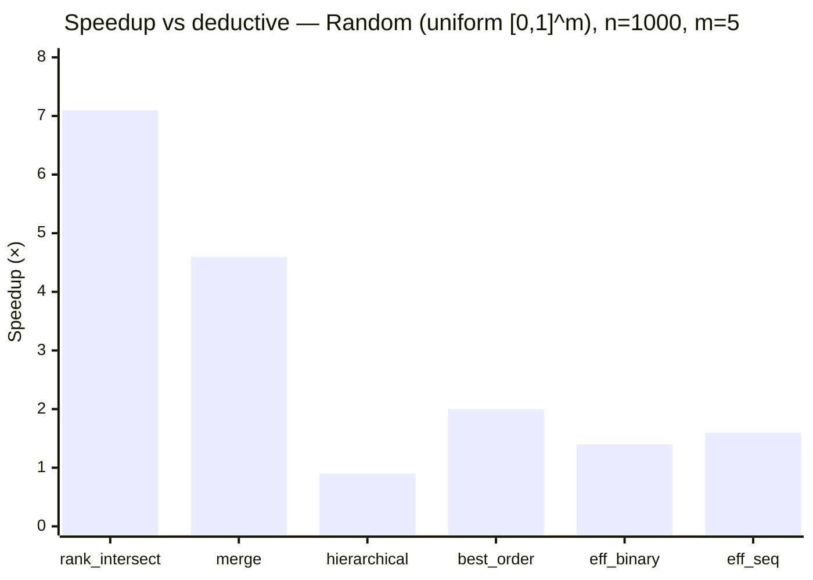
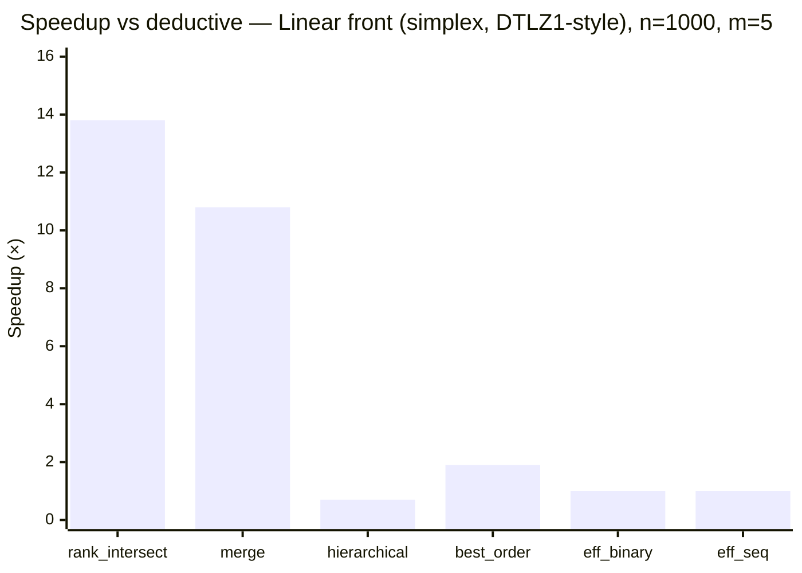
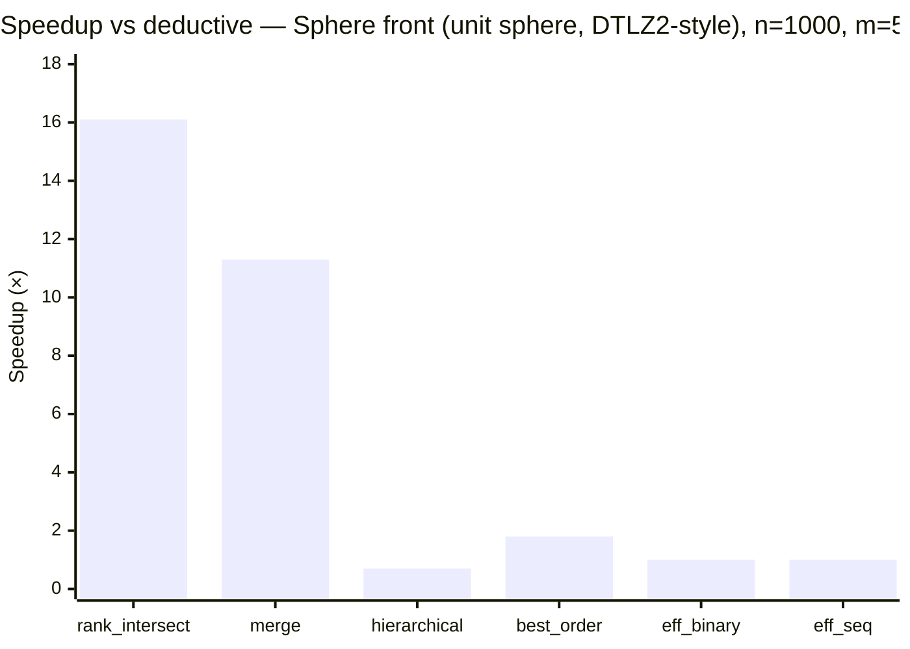
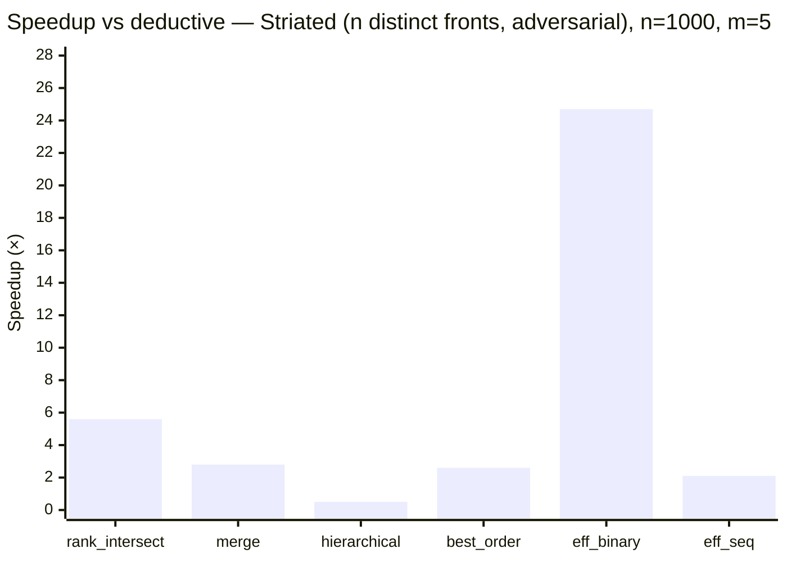
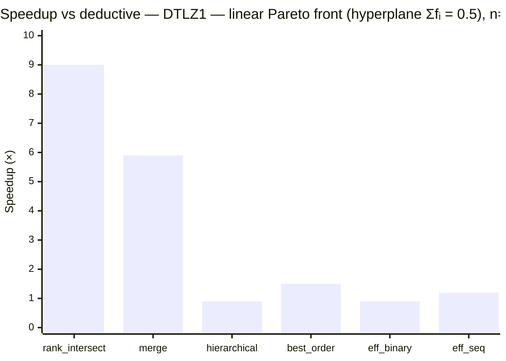
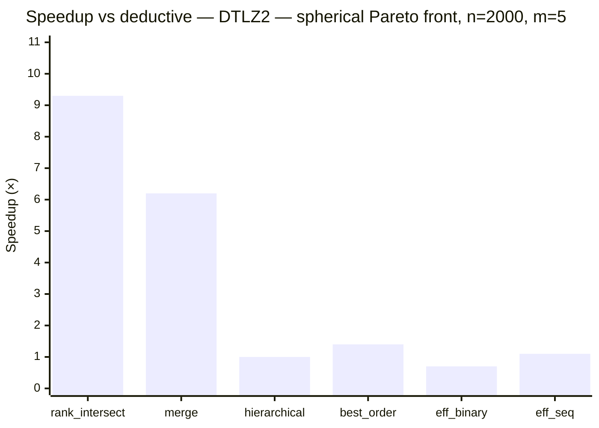
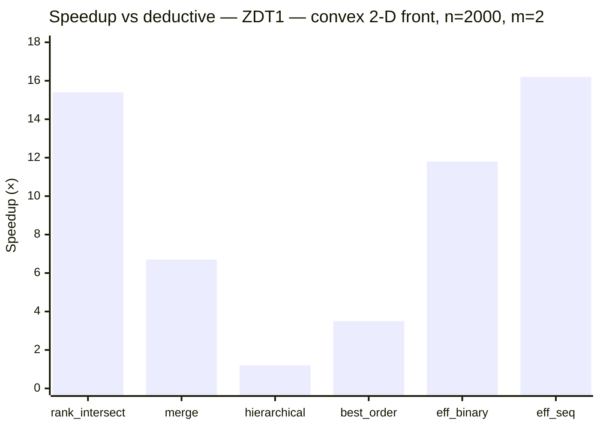
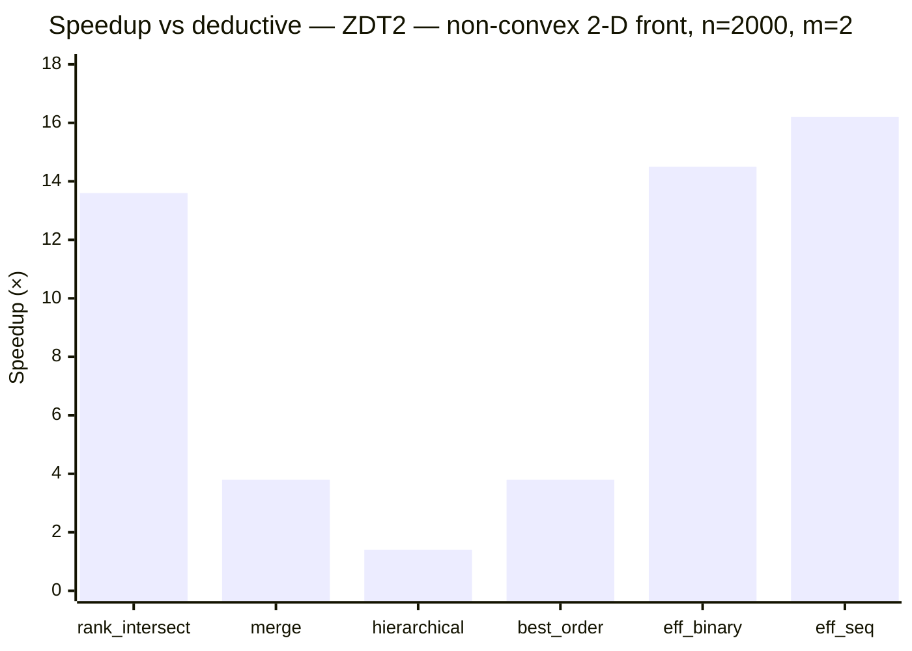

# Benchmarks

Times are wall-clock **µs/sort** (one full population ranking).
The fastest sorter per row is **bold**. Entries with >2 % MAPE are marked \*.

## Environment

<!-- Fill in before committing: CPU, compiler, flags, any relevant notes. -->

## Sorters

| Short name | Algorithm | Complexity (best / worst) | Reference |
|:---|:---|:---|:---|
| `deductive` | Deductive sort | O(MN²) expected / Θ(MN³) | [Mishra & Buzdalov, GECCO 2020](https://doi.org/10.1145/3377930.3390246) |
| `rank_intersect` | Rank-intersect NDS — packed triangular bitsets, SIMD intersection, rank propagation | O(MN log N) avg / O(MN²) | [Burlacu, arXiv 2022](https://arxiv.org/abs/2203.13654) |
| `merge` | Merge NDS (MNDS) | O(N log N) best / O(MN²) | [Moreno et al., IEEE TCYB 2020](https://doi.org/10.1109/TCYB.2020.2968301) |
| `hierarchical` | Hierarchical NDS (HNDS) | O(MN√N) best / O(MN²) | [Bao et al., J. Comput. Sci. 2017](https://doi.org/10.1016/j.jocs.2017.09.015) |
| `best_order` | Best Order Sort (BOS) | O(MN log N) best / O(MN²) | [Roy et al., GECCO 2016](https://doi.org/10.1145/2908961.2931684) |
| `eff_binary` | ENS-BS — efficient NDS, binary search (requires lex-sorted input) | O(MN log N) best / O(MN²) | [Zhang et al., IEEE TEC 2015](https://doi.org/10.1109/TEVC.2014.2308305) |
| `eff_seq` | ENS-SS — efficient NDS, sequential search (requires lex-sorted input) | O(MN√N) best / O(MN²) | [Zhang et al., IEEE TEC 2015](https://doi.org/10.1109/TEVC.2014.2308305) |

## Synthetic benchmarks

Four distributions covering the main cases from the literature
(Jensen 2003; Fortin & Parizeau 2013; Buzdalov & Shalyto 2014):

- **random** — uniform [0,1]^m; typical EA population.
- **linear\_front** — all points on the (m−1)-simplex (Σfᵢ = 1); DTLZ1-style converged front.
- **sphere\_front** — all points on the positive unit sphere; DTLZ2-style converged front.
- **striated** — individual i has fⱼ = i for all j; n distinct fronts; worst case for O(n·|F₀|) inner loops.

### Random (uniform [0,1]^m)

*All times in µs.*

| n | m | deductive | rank\_intersect | merge | hierarchical | best\_order | eff\_binary | eff\_seq |
| --: | --: | --: | --: | --: | --: | --: | --: | --: |
| 100 | 2 | 10.9 | 9.1 | 15.1 | 15.6 | 15.4 | 7.3 | **7.0** |
| 100 | 5 | 14.0 | 22.6 | 23.0 | 8.8 | 26.3 | 9.8 | **7.4** |
| 100 | 10 | 43.8 | 44.4 | 46.4 | 18.2 | 48.0 | 13.0 | **11.1** |
| 500 | 2 | 361.9 | **33.0** | 132.4 | 322.3 | 104.8 | 42.0 | 46.2 |
| 500 | 5 | 309.1 | **71.2** | 91.4 | 353.7 | 182.3 | 232.3 | 192.1 |
| 500 | 10 | 965.6 | **143.3** | 162.1 | 855.5 | 320.6 | 637.9 | 624.0 |
| 1000 | 2 | 1369.2 | **102.7** | 411.3 | 1050.6 | 370.1 | 128.1 | 109.5 |
| 1000 | 5 | 1173.9 | **166.3** | 256.0 | 1305.3 | 597.1 | 856.5 | 721.9 |
| 1000 | 10 | 3565.0 | **346.8** | 359.8 | 2998.5 | 964.4 | 2569.7 | 2437.4 |

### Linear front (simplex, DTLZ1-style)

*All times in µs.*

| n | m | deductive | rank\_intersect | merge | hierarchical | best\_order | eff\_binary | eff\_seq |
| --: | --: | --: | --: | --: | --: | --: | --: | --: |
| 100 | 2 | 11.5 | **6.9** | 9.4 | 16.2 | 12.6 | 9.2 | 9.1 |
| 100 | 5 | 22.8 | 21.7 | 22.8 | 13.2 | 26.0 | 11.5 | **10.5** |
| 100 | 10 | 44.2 | 47.3 | 42.7 | 17.8 | 50.6 | 12.8 | **11.6** |
| 500 | 2 | 259.7 | **20.0** | 32.6 | 392.9 | 101.0 | 131.7 | 126.9 |
| 500 | 5 | 518.1 | **72.5** | 87.7 | 669.6 | 281.5 | 442.4 | 450.7 |
| 500 | 10 | 1068.7 | **144.3** | 160.8 | 874.6 | 297.5 | 617.2 | 635.9 |
| 1000 | 2 | 986.7 | **43.1** | 65.5 | 1420.1 | 345.8 | 480.0 | 452.0 |
| 1000 | 5 | 2036.9 | **147.7** | 188.5 | 2775.9 | 1097.5 | 1957.1 | 2009.1 |
| 1000 | 10 | 4290.3 | **312.8** | 359.2 | 3510.4 | 1000.8 | 2707.3 | 2801.4 |

### Sphere front (unit sphere, DTLZ2-style)

*All times in µs.*

| n | m | deductive | rank\_intersect | merge | hierarchical | best\_order | eff\_binary | eff\_seq |
| --: | --: | --: | --: | --: | --: | --: | --: | --: |
| 100 | 2 | 11.9 | **6.5** | 9.1 | 16.2 | 12.2 | 9.0 | 8.8 |
| 100 | 5 | 22.9 | 21.8 | 22.0 | 13.2 | 25.9 | 11.2 | **10.2** |
| 100 | 10 | 45.1 | 48.0 | 42.9 | 18.1 | 49.3 | 12.2 | **11.1** |
| 500 | 2 | 251.3 | **21.5** | 32.6 | 365.2 | 99.8 | 131.1 | 126.9 |
| 500 | 5 | 518.0 | **68.1** | 80.8 | 657.0 | 295.9 | 432.5 | 434.0 |
| 500 | 10 | 1074.1 | **144.9** | 158.5 | 883.7 | 302.1 | 612.6 | 641.1 |
| 1000 | 2 | 1005.4 | **43.8** | 66.2 | 1438.7 | 346.6 | 480.0 | 459.6 |
| 1000 | 5 | 2066.5 | **128.1** | 183.4 | 2772.0 | 1154.6 | 1999.9 | 2075.4 |
| 1000 | 10 | 4275.3 | **297.7** | 357.2 | 3525.7 | 1020.7 | 2685.4 | 2810.6 |

### Striated (n distinct fronts, adversarial)

*All times in µs.*

| n | m | deductive | rank\_intersect | merge | hierarchical | best\_order | eff\_binary | eff\_seq |
| --: | --: | --: | --: | --: | --: | --: | --: | --: |
| 100 | 2 | 24.3 | 16.6 | 22.6 | 55.0 | 26.0 | **9.4** | 14.7 |
| 100 | 5 | 33.8 | 30.4 | 22.1 | 57.8 | 47.9 | **9.5** | 19.7 |
| 100 | 10 | 56.2 | 55.9 | 23.3 | 73.7 | 87.9 | **11.0** | 31.4 |
| 500 | 2 | 457.3 | 135.4 | 269.6 | 1372.0 | 258.6 | **50.7** | 187.5 |
| 500 | 5 | 679.3 | 169.7 | 275.8 | 1462.8 | 324.4 | **52.9** | 351.9 |
| 500 | 10 | 1243.3 | 231.0 | 282.7 | 1822.2 | 472.5 | **63.2** | 657.1 |
| 1000 | 2 | 1704.2 | 419.9 | 957.2 | 5464.7 | 898.9 | **99.9** | 636.1 |
| 1000 | 5 | 2674.6 | 474.4 | 971.0 | 5771.7 | 1043.1 | **108.3** | 1295.2 |
| 1000 | 10 | 4939.6 | 584.3 | 985.2 | 7236.7 | 1262.6 | **130.0** | 2370.5 |

## Literature instances (from `test/data/`)

Generated by `test/data/generate.py` using the standard DTLZ1, DTLZ2, ZDT1, ZDT2
formulations (Deb et al. 2002; Zitzler et al. 2000). Each instance uses uniformly
sampled decision variables, producing a realistic mix of dominated and non-dominated solutions.

### DTLZ1 — linear Pareto front (hyperplane Σfᵢ = 0.5)

*All times in µs.*

| n | m | deductive | rank\_intersect | merge | hierarchical | best\_order | eff\_binary | eff\_seq |
| --: | --: | --: | --: | --: | --: | --: | --: | --: |
| 500 | 2 | 334.4 | **32.3** | 90.4 | 275.2 | 106.2 | 45.0 | 39.4 |
| 500 | 3 | 284.2 | **42.5** | 71.5 | 275.5 | 133.1 | 102.3 | 76.2 |
| 500 | 5 | 308.4 | **77.5** | 93.5 | 358.9 | 258.4 | 338.3 | 267.8 |
| 500 | 10 | 593.6 | **147.9** | 187.2 | 636.7 | 409.4 | 816.0 | 660.6 |
| 2000 | 2 | 4662.8 | 325.9 | 824.0 | 3616.8 | 1285.5 | 353.8 | **274.5** |
| 2000 | 3 | 3464.3 | **303.9** | 709.3 | 3322.4 | 1639.2 | 1124.3 | 868.9 |
| 2000 | 5 | 4027.9 | **447.4** | 678.7 | 4524.8 | 2614.3 | 4404.5 | 3249.8 |
| 2000 | 10 | 7271.2 | **754.9** | 963.7 | 7279.7 | 3476.3 | 8892.6 | 7152.2 |

### DTLZ2 — spherical Pareto front

*All times in µs.*

| n | m | deductive | rank\_intersect | merge | hierarchical | best\_order | eff\_binary | eff\_seq |
| --: | --: | --: | --: | --: | --: | --: | --: | --: |
| 500 | 2 | 303.0 | **28.8** | 72.3 | 251.6 | 92.4 | 50.7 | 41.4 |
| 500 | 3 | 250.6 | **42.2** | 61.8 | 214.3 | 124.6 | 124.1 | 78.1 |
| 500 | 5 | 273.6 | **75.1** | 91.3 | 305.0 | 232.9 | 398.3 | 264.9 |
| 500 | 10 | 506.2 | **157.6** | 184.2 | 498.2 | 402.4 | 837.0 | 618.8 |
| 2000 | 2 | 4417.6 | 286.6 | 683.5 | 3657.3 | 1014.3 | 381.7 | **275.4** |
| 2000 | 3 | 3123.8 | **295.8** | 552.4 | 2723.1 | 1454.0 | 1285.3 | 872.9 |
| 2000 | 5 | 3677.0 | **397.0** | 589.7 | 3828.2 | 2692.6 | 5407.3 | 3270.9 |
| 2000 | 10 | 6641.0 | **802.0** | 920.3 | 6277.7 | 4197.4 | 9851.6 | 7387.0 |

### ZDT1 — convex 2-D front

*All times in µs.*

| n | m | deductive | rank\_intersect | merge | hierarchical | best\_order | eff\_binary | eff\_seq |
| --: | --: | --: | --: | --: | --: | --: | --: | --: |
| 500 | 2 | 316.6 | **27.4** | 72.1 | 280.8 | 104.8 | 49.1 | 39.7 |
| 2000 | 2 | 4462.8 | 289.8 | 669.1 | 3613.5 | 1269.8 | 378.7 | **275.0** |

### ZDT2 — non-convex 2-D front

*All times in µs.*

| n | m | deductive | rank\_intersect | merge | hierarchical | best\_order | eff\_binary | eff\_seq |
| --: | --: | --: | --: | --: | --: | --: | --: | --: |
| 500 | 2 | 356.0 | **31.5** | 119.3 | 301.3 | 109.6 | 41.6 | 44.5 |
| 2000 | 2 | 4852.5 | 355.8 | 1280.4 | 3506.3 | 1279.5 | 334.8 | **300.0** |

