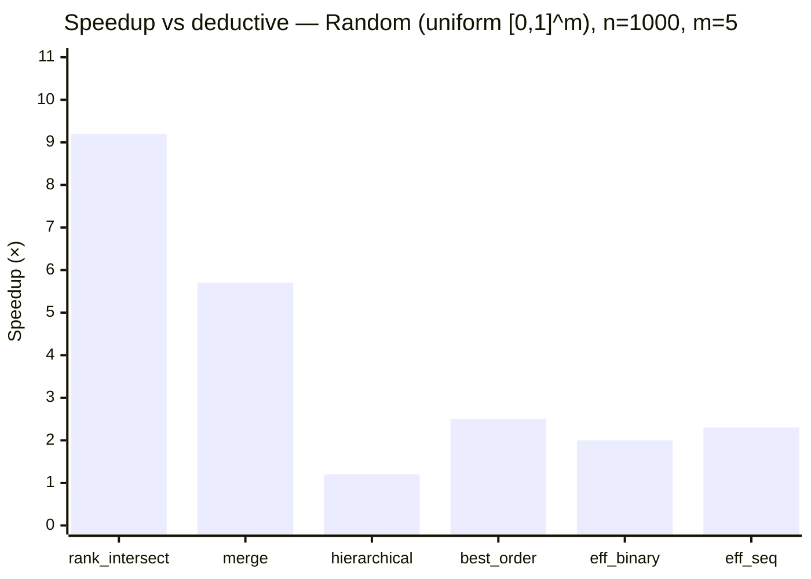
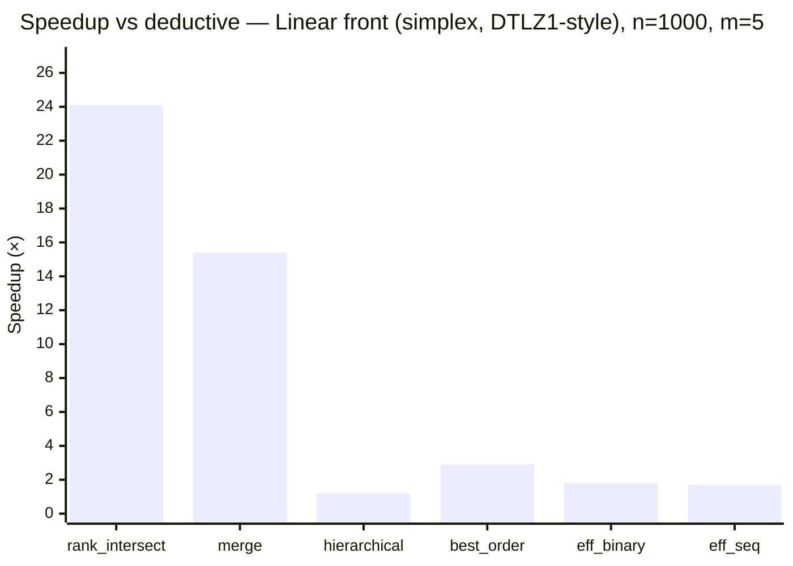
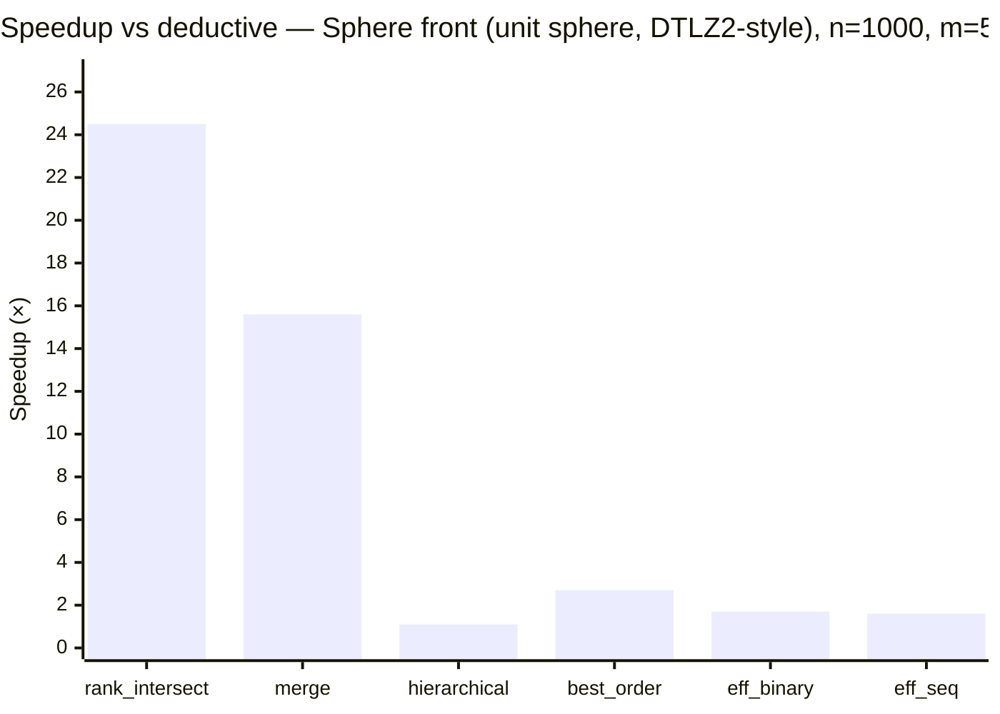
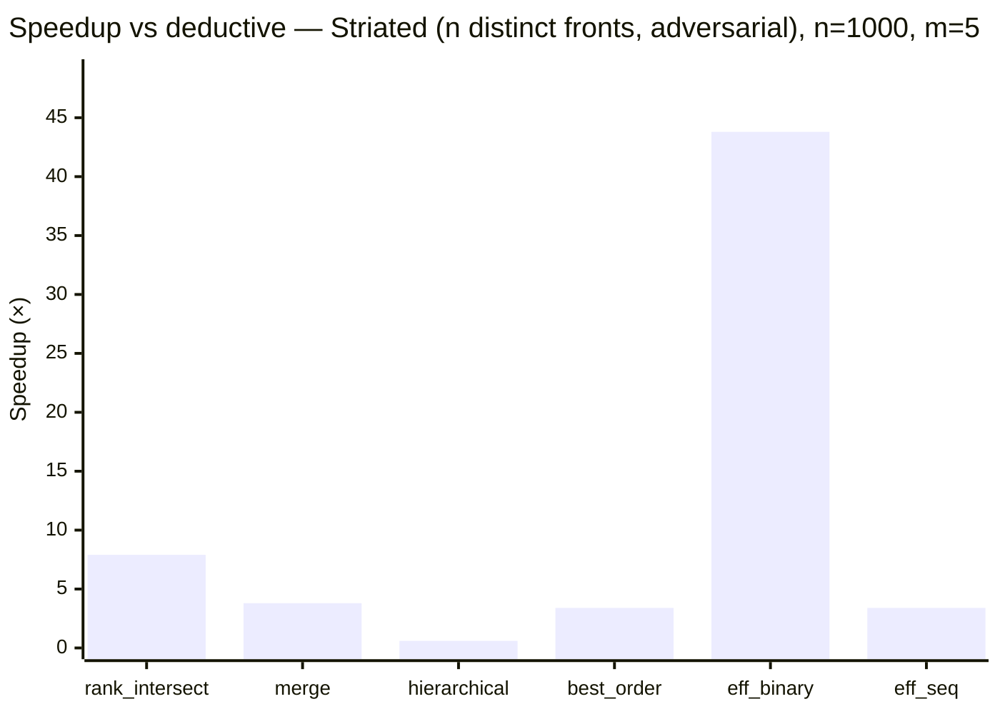
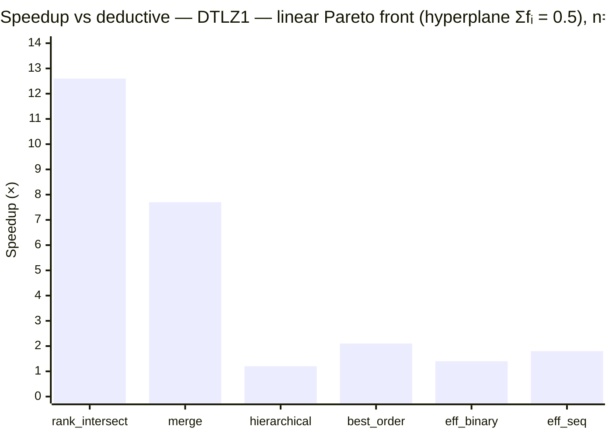
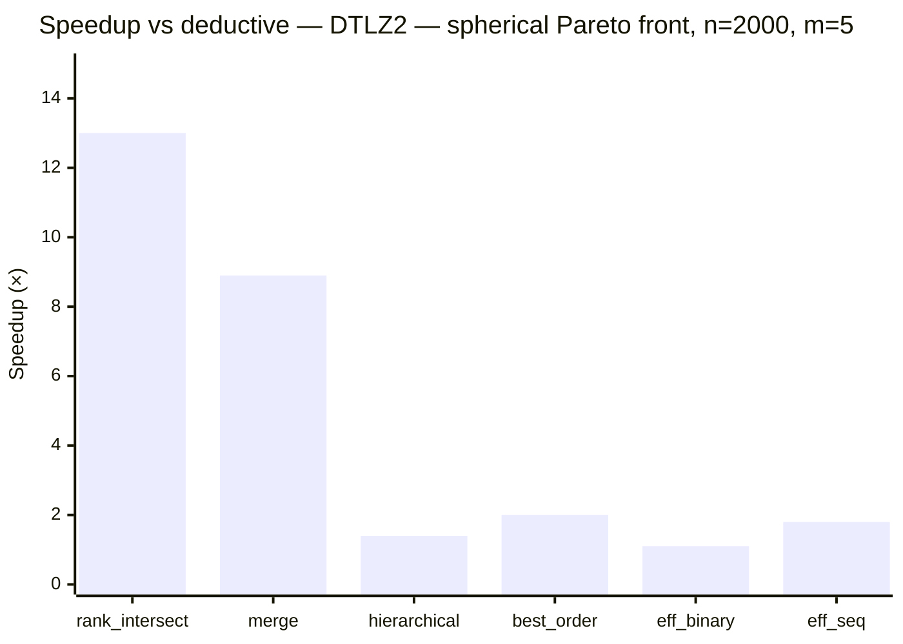
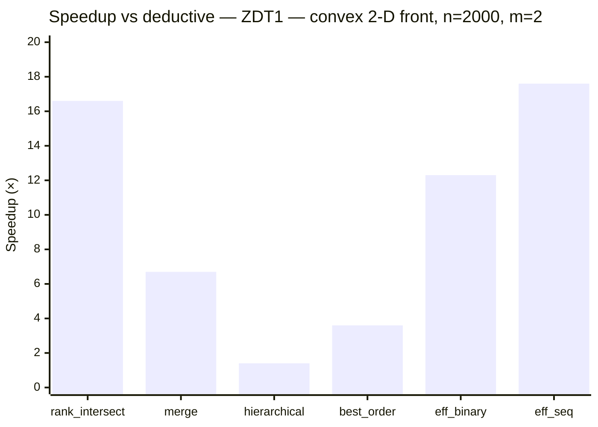
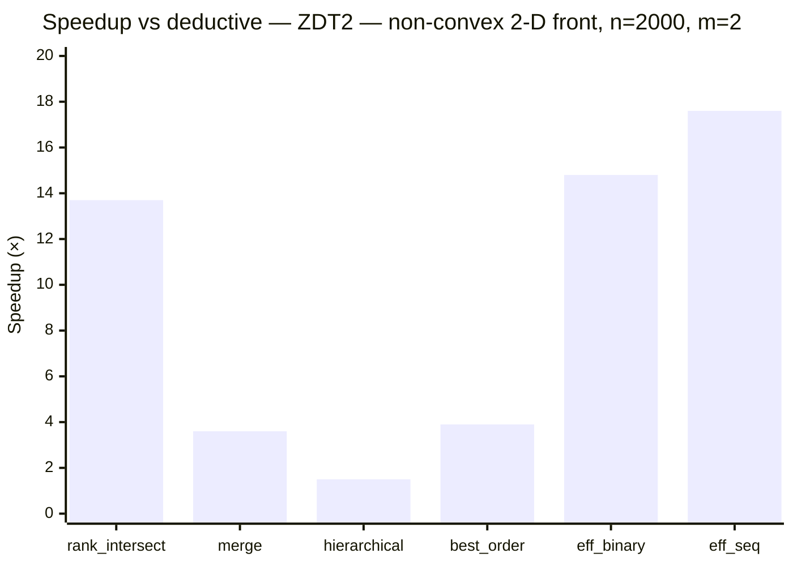

# Benchmarks

Times are wall-clock **µs/sort** (one full population ranking).
The fastest sorter per row is **bold**. Entries with >2 % MAPE are marked \*.

## Environment

- **CPU**: AMD Ryzen 9 5950X 16-Core Processor
- **Compiler**: clang 21, `-march=x86-64-v3 -O3`
- **Measurement**: [nanobench](https://github.com/martinus/nanobench) — 3 warmup iterations, ≥5 measurement iterations per epoch
- **Note**: CPU frequency scaling was active during this run; relative rankings are reliable but absolute times may vary ±10%.

## Sorters

| Short name | Algorithm | Complexity (best / worst) | Reference |
|:---|:---|:---|:---|
| `deductive` | Deductive sort | O(MN²) expected / Θ(MN³) | [Mishra & Buzdalov, GECCO 2020](https://doi.org/10.1145/3377930.3390246) |
| `rank_intersect` | Rank-intersect NDS — packed triangular bitsets, SIMD intersection, rank propagation | O(MN log N) avg / O(MN²) | [Burlacu, arXiv 2022](https://arxiv.org/abs/2203.13654) |
| `merge` | Merge NDS (MNDS) | O(N log N) best / O(MN²) | [Moreno et al., IEEE TCYB 2020](https://doi.org/10.1109/TCYB.2020.2968301) |
| `hierarchical` | Hierarchical NDS (HNDS) | O(MN√N) best / O(MN²) | [Bao et al., J. Comput. Sci. 2017](https://doi.org/10.1016/j.jocs.2017.09.015) |
| `best_order` | Best Order Sort (BOS) | O(MN log N) best / O(MN²) | [Roy et al., GECCO 2016](https://doi.org/10.1145/2908961.2931684) |
| `eff_binary` | ENS-BS — efficient NDS, binary search (requires lex-sorted input) | O(MN log N) best / O(MN²) | [Zhang et al., IEEE TEC 2015](https://doi.org/10.1109/TEVC.2014.2308305) |
| `eff_seq` | ENS-SS — efficient NDS, sequential search (requires lex-sorted input) | O(MN√N) best / O(MN²) | [Zhang et al., IEEE TEC 2015](https://doi.org/10.1109/TEVC.2014.2308305) |

## Synthetic benchmarks

Four distributions covering the main cases from the literature
(Jensen 2003; Fortin & Parizeau 2013; Buzdalov & Shalyto 2014):

- **random** — uniform [0,1]^m; typical EA population.
- **linear\_front** — all points on the (m−1)-simplex (Σfᵢ = 1); DTLZ1-style converged front.
- **sphere\_front** — all points on the positive unit sphere; DTLZ2-style converged front.
- **striated** — individual i has fⱼ = i for all j; n distinct fronts; worst case for O(n·|F₀|) inner loops.

### Random (uniform [0,1]^m)

*All times in µs.*

| n | m | deductive | rank\_intersect | merge | hierarchical | best\_order | eff\_binary | eff\_seq |
| --: | --: | --: | --: | --: | --: | --: | --: | --: |
| 100 | 2 | 11.6 | 8.2 | 14.2 | 12.9 | 13.8 | 5.5 | **5.5** |
| 100 | 5 | 20.1 | 21.1 | 22.9 | 8.3 | 25.1 | 9.0 | **6.9** |
| 100 | 10 | 40.6 | 43.0 | 45.2 | 14.6 | 46.9 | 12.0 | **11.0** |
| 500 | 2 | 395.9 | **27.9** | 128.2 | 290.9 | 95.3 | 35.1 | 37.3 |
| 500 | 5 | 367.0 | **69.8** | 96.2 | 319.7 | 177.7 | 207.9 | 166.5 |
| 500 | 10 | 949.5 | **132.4** | 165.5 | 750.5 | 308.5 | 536.9 | 528.4 |
| 1000 | 2 | 1340.4 | **83.4** | 405.3 | 930.0 | 338.2 | 110.0 | 89.0 |
| 1000 | 5 | 1436.4 | **156.1** | 253.9 | 1186.5 | 568.7 | 735.9 | 620.8 |
| 1000 | 10 | 3573.4 | **329.5** | 361.9 | 2658.5 | 932.8 | 2157.3 | 2110.0 |

### Linear front (simplex, DTLZ1-style)

*All times in µs.*

| n | m | deductive | rank\_intersect | merge | hierarchical | best\_order | eff\_binary | eff\_seq |
| --: | --: | --: | --: | --: | --: | --: | --: | --: |
| 100 | 2 | 14.7 | **6.3** | 9.5 | 13.3 | 12.5 | 9.0 | 8.3 |
| 100 | 5 | 29.8 | 21.3 | 23.2 | 14.1 | 25.4 | 10.8 | **10.1** |
| 100 | 10 | 42.6 | 45.7 | 43.9 | 14.7 | 49.3 | 11.9 | **11.0** |
| 500 | 2 | 350.4 | **18.2** | 32.3 | 281.8 | 94.9 | 127.3 | 110.8 |
| 500 | 5 | 718.7 | **66.0** | 86.6 | 646.8 | 272.4 | 390.5 | 381.3 |
| 500 | 10 | 1037.4 | **131.2** | 163.6 | 766.4 | 288.3 | 534.3 | 529.4 |
| 1000 | 2 | 1397.0 | **38.2** | 64.0 | 1135.4 | 326.2 | 471.7 | 402.5 |
| 1000 | 5 | 2994.1 | **124.3** | 194.1 | 2603.2 | 1020.6 | 1692.6 | 1721.6 |
| 1000 | 10 | 4211.3 | **307.9** | 372.7 | 3099.7 | 943.6 | 2277.6 | 2459.0 |

### Sphere front (unit sphere, DTLZ2-style)

*All times in µs.*

| n | m | deductive | rank\_intersect | merge | hierarchical | best\_order | eff\_binary | eff\_seq |
| --: | --: | --: | --: | --: | --: | --: | --: | --: |
| 100 | 2 | 14.9 | **5.8** | 8.7 | 12.8 | 11.3 | 8.4 | 8.3 |
| 100 | 5 | 29.7 | 20.6 | 22.8 | 14.0 | 24.8 | 10.5 | **9.7** |
| 100 | 10 | 42.7 | 45.5 | 43.4 | 15.0 | 49.0 | 11.6 | **10.8** |
| 500 | 2 | 353.9 | **19.4** | 32.4 | 281.5 | 95.1 | 128.1 | 114.3 |
| 500 | 5 | 722.3 | **64.7** | 82.5 | 627.4 | 275.9 | 383.4 | 369.9 |
| 500 | 10 | 1042.3 | **129.5** | 162.9 | 766.0 | 293.3 | 524.6 | 531.6 |
| 1000 | 2 | 1391.0 | **38.7** | 63.7 | 1120.7 | 324.3 | 478.7 | 411.3 |
| 1000 | 5 | 2864.2 | **117.1** | 183.7 | 2566.3 | 1060.2 | 1733.9 | 1761.2 |
| 1000 | 10 | 4193.1 | **306.7** | 382.8 | 3083.8 | 953.4 | 2229.0 | 2332.5 |

### Striated (n distinct fronts, adversarial)

*All times in µs.*

| n | m | deductive | rank\_intersect | merge | hierarchical | best\_order | eff\_binary | eff\_seq |
| --: | --: | --: | --: | --: | --: | --: | --: | --: |
| 100 | 2 | 39.6 | 13.9 | 20.3 | 51.5 | 23.3 | **6.7** | 10.5 |
| 100 | 5 | 39.8 | 28.6 | 20.4 | 56.5 | 45.6 | **6.5** | 14.3 |
| 100 | 10 | 52.6 | 53.4 | 21.1 | 62.1 | 83.5 | **7.9** | 22.5 |
| 500 | 2 | 518.1 | 119.7 | 256.9 | 1345.2 | 252.9 | **35.6** | 141.6 |
| 500 | 5 | 890.6 | 156.3 | 266.9 | 1445.3 | 319.9 | **39.3** | 278.7 |
| 500 | 10 | 1211.9 | 212.8 | 265.1 | 1636.3 | 447.5 | **47.3** | 508.5 |
| 1000 | 2 | 2037.7 | 387.0 | 927.2 | 5577.4 | 918.7 | **74.1** | 510.9 |
| 1000 | 5 | 3550.6 | 446.9 | 945.0 | 5723.3 | 1056.1 | **81.1** | 1059.2 |
| 1000 | 10 | 4819.0 | 550.7 | 956.8 | 6605.2 | 1323.4 | **100.5** | 2008.8 |

## Literature instances (from `test/data/`)

Generated by `test/data/generate.py` using the standard DTLZ1, DTLZ2, ZDT1, ZDT2
formulations (Deb et al. 2002; Zitzler et al. 2000). Each instance uses uniformly
sampled decision variables, producing a realistic mix of dominated and non-dominated solutions.

### DTLZ1 — linear Pareto front (hyperplane Σfᵢ = 0.5)

*All times in µs.*

| n | m | deductive | rank\_intersect | merge | hierarchical | best\_order | eff\_binary | eff\_seq |
| --: | --: | --: | --: | --: | --: | --: | --: | --: |
| 500 | 2 | 383.9 | **29.6** | 89.6 | 243.7 | 103.0 | 41.8 | 34.9 |
| 500 | 3 | 320.4 | **39.4** | 70.7 | 259.8 | 129.4 | 100.0 | 66.1 |
| 500 | 5 | 413.1 | **71.1** | 93.0 | 334.5 | 243.5 | 291.2 | 234.0 |
| 500 | 10 | 727.9 | **151.2** | 181.4 | 567.4 | 393.3 | 663.0 | 575.3 |
| 2000 | 2 | 4605.5 | 300.4 | 805.5 | 3102.0 | 1215.4 | 328.9 | **241.6** |
| 2000 | 3 | 3762.4 | **289.5** | 698.6 | 3162.0 | 1562.4 | 1025.4 | 771.5 |
| 2000 | 5 | 5068.4 | **402.4** | 662.1 | 4143.9 | 2440.1 | 3682.3 | 2867.8 |
| 2000 | 10 | 9547.9 | **794.0** | 954.2 | 6480.4 | 3422.3 | 7320.5 | 6252.8 |

### DTLZ2 — spherical Pareto front

*All times in µs.*

| n | m | deductive | rank\_intersect | merge | hierarchical | best\_order | eff\_binary | eff\_seq |
| --: | --: | --: | --: | --: | --: | --: | --: | --: |
| 500 | 2 | 398.1 | **24.5** | 70.1 | 215.9 | 86.8 | 44.6 | 34.7 |
| 500 | 3 | 332.8 | **35.4** | 57.9 | 198.3 | 114.8 | 102.5 | 67.0 |
| 500 | 5 | 425.3 | **65.6** | 90.5 | 288.6 | 220.9 | 309.9 | 227.4 |
| 500 | 10 | 575.8 | **145.4** | 185.0 | 452.5 | 390.5 | 665.2 | 524.9 |
| 2000 | 2 | 4595.3 | 268.6 | 665.0 | 3114.6 | 971.9 | 362.2 | **245.7** |
| 2000 | 3 | 3705.3 | **284.7** | 546.7 | 2574.5 | 1384.1 | 1160.0 | 786.2 |
| 2000 | 5 | 5053.5 | **388.4** | 569.0 | 3495.0 | 2516.4 | 4438.7 | 2864.4 |
| 2000 | 10 | 7668.3 | **761.2** | 908.3 | 5586.4 | 4085.1 | 7944.4 | 6405.2 |

### ZDT1 — convex 2-D front

*All times in µs.*

| n | m | deductive | rank\_intersect | merge | hierarchical | best\_order | eff\_binary | eff\_seq |
| --: | --: | --: | --: | --: | --: | --: | --: | --: |
| 500 | 2 | 375.1 | **23.9** | 70.1 | 240.3 | 97.9 | 44.2 | 34.3 |
| 2000 | 2 | 4386.0 | 264.0 | 652.9 | 3043.7 | 1207.6 | 355.5 | **249.7** |

### ZDT2 — non-convex 2-D front

*All times in µs.*

| n | m | deductive | rank\_intersect | merge | hierarchical | best\_order | eff\_binary | eff\_seq |
| --: | --: | --: | --: | --: | --: | --: | --: | --: |
| 500 | 2 | 399.0 | **26.9** | 116.4 | 270.9 | 105.9 | 36.1 | 36.3 |
| 2000 | 2 | 4554.6 | 331.3 | 1249.9 | 3091.5 | 1178.6 | 307.8 | **259.5** |

