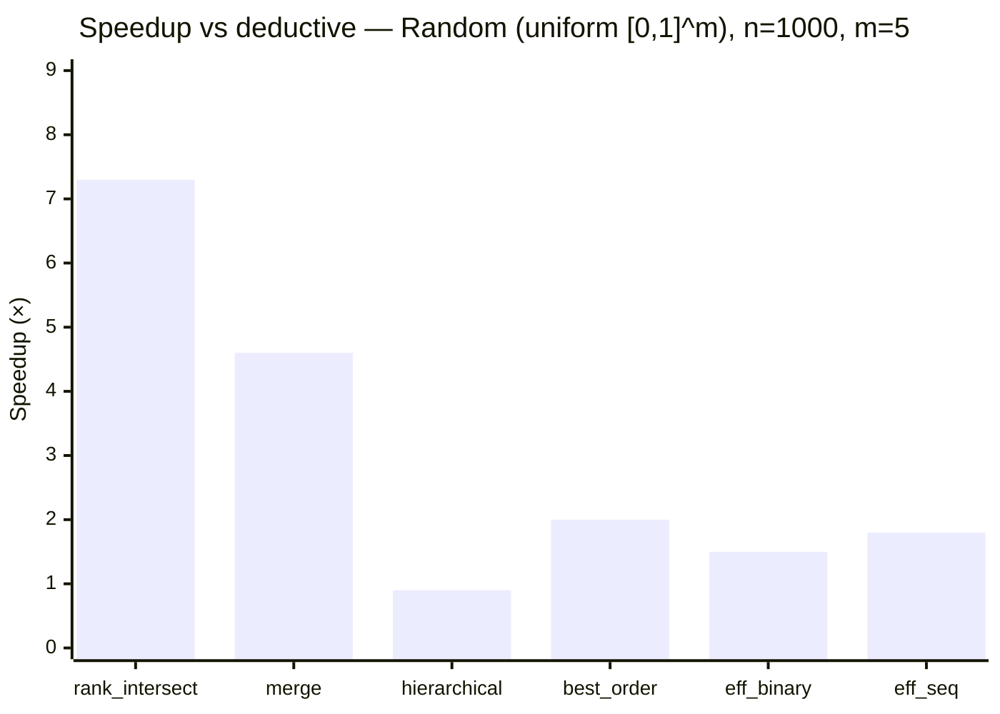
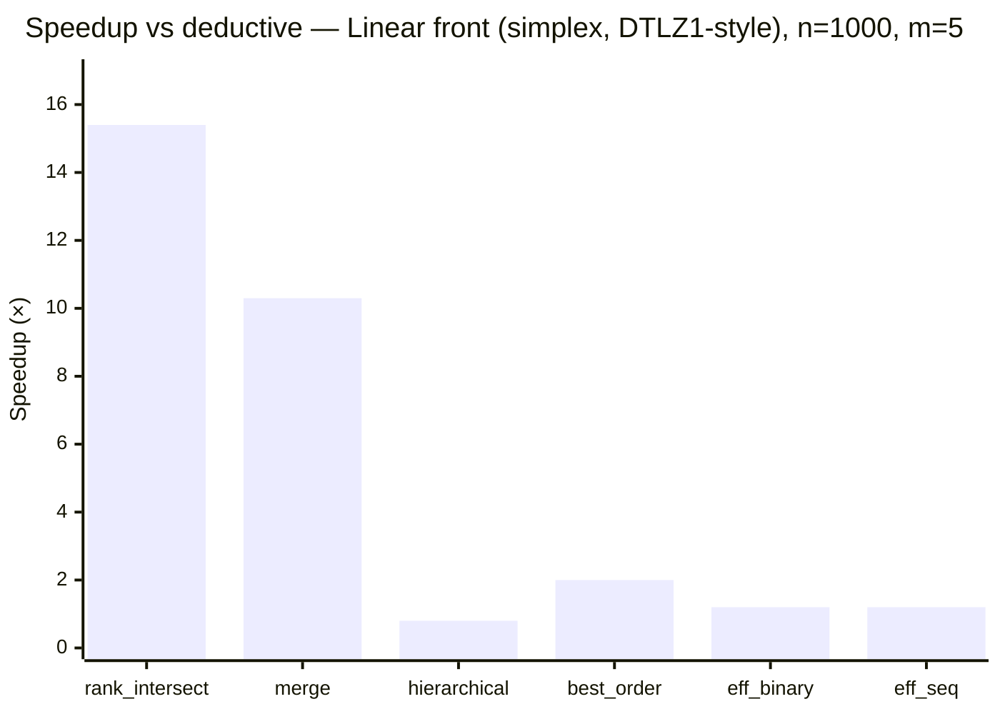
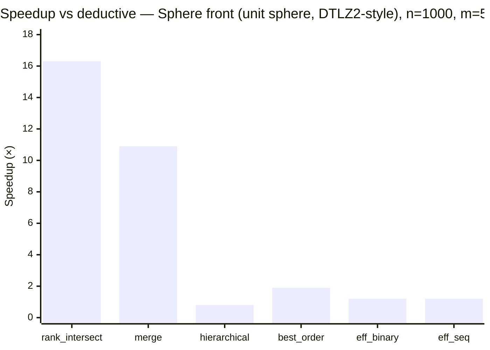
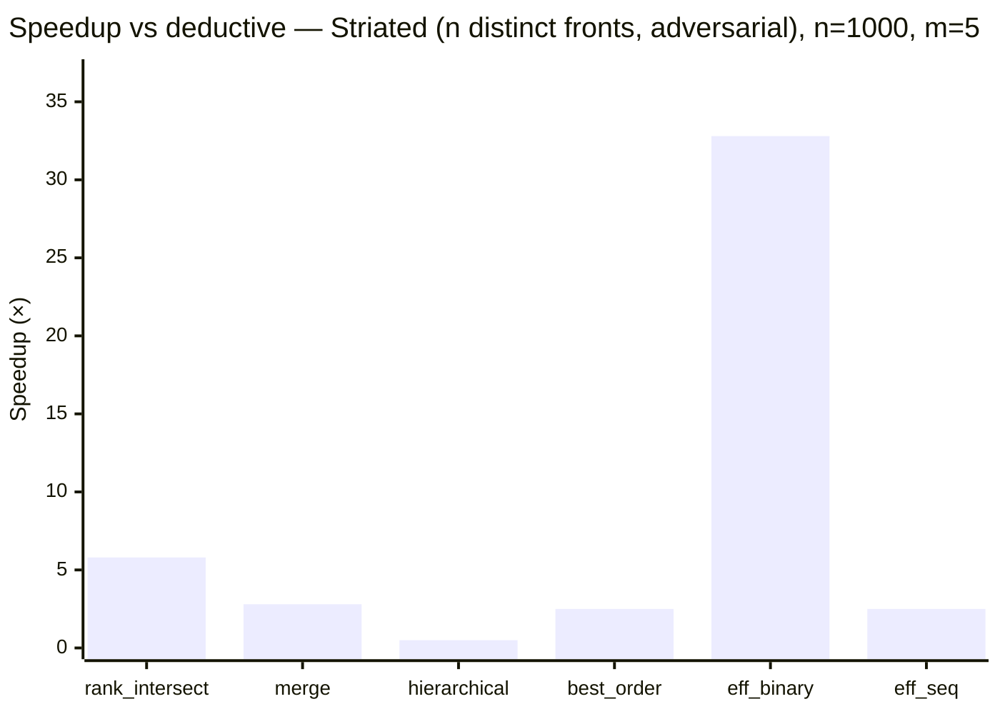
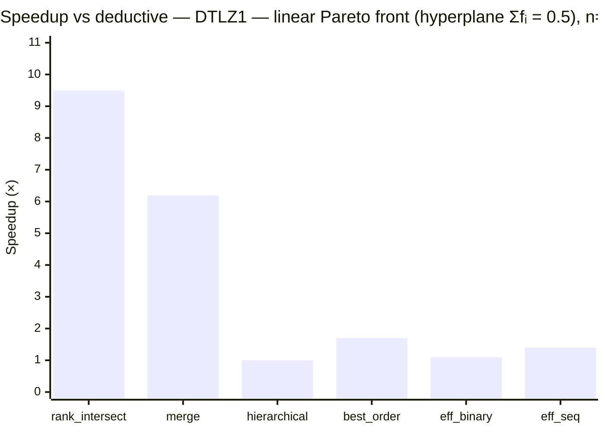
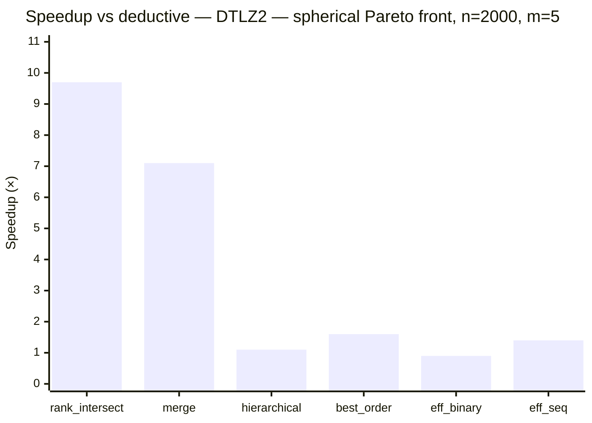
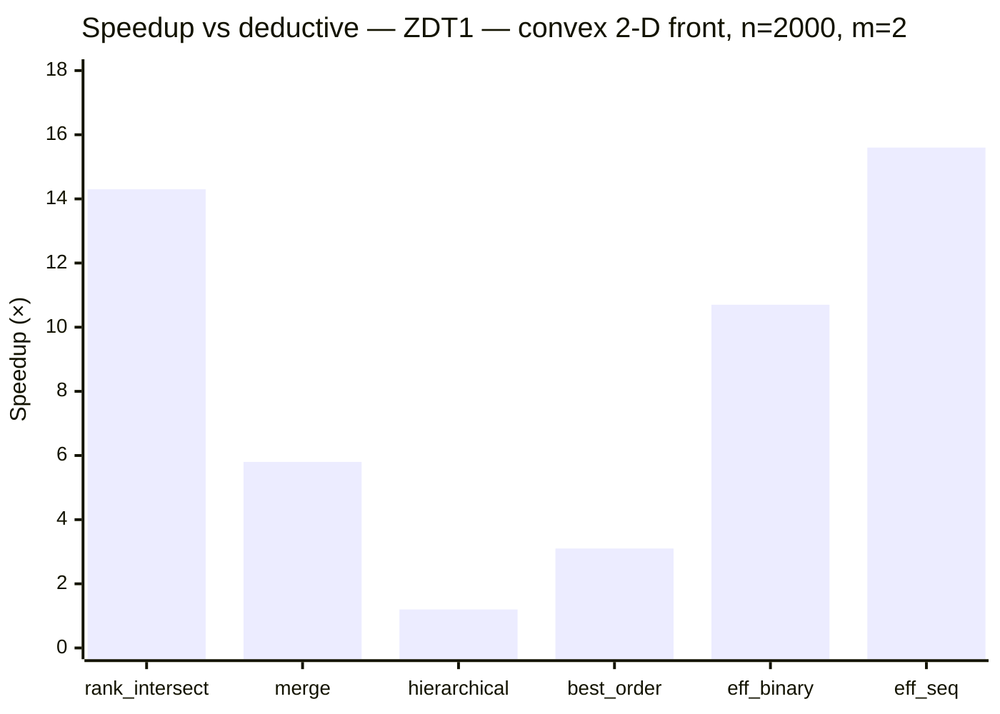
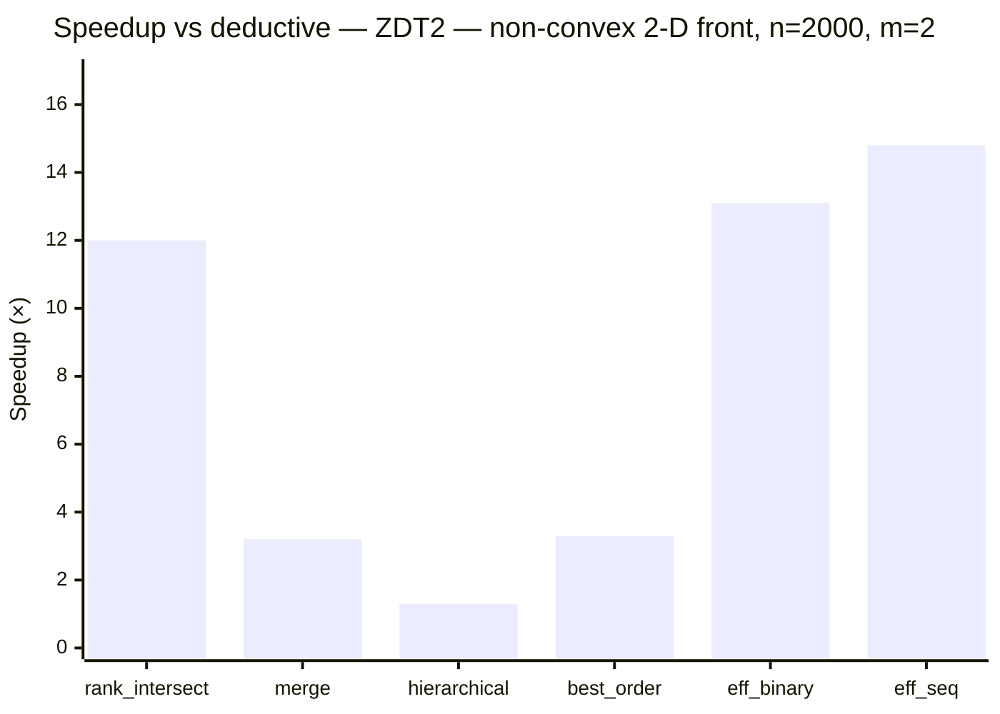

# Benchmarks

Times are wall-clock **µs/sort** (one full population ranking).
The fastest sorter per row is **bold**. Entries with >2 % MAPE are marked \*.

## Environment

CPU: AMD Ryzen 9 5950X · Compiler: clang 21 · Flags: `-march=x86-64-v3 -O3` · CPU scaling active (results may vary slightly run to run)

## Sorters

| Short name | Algorithm | Complexity (best / worst) | Reference |
|:---|:---|:---|:---|
| `deductive` | Deductive sort | O(MN²) expected / Θ(MN³) | [Mishra & Buzdalov, GECCO 2020](https://doi.org/10.1145/3377930.3390246) |
| `rank_intersect` | Rank-intersect NDS — packed triangular bitsets, SIMD intersection, rank propagation | O(MN log N) avg / O(MN²) | [Burlacu, arXiv 2022](https://arxiv.org/abs/2203.13654) |
| `merge` | Merge NDS (MNDS) | O(N log N) best / O(MN²) | [Moreno et al., IEEE TCYB 2020](https://doi.org/10.1109/TCYB.2020.2968301) |
| `hierarchical` | Hierarchical NDS (HNDS) | O(MN√N) best / O(MN²) | [Bao et al., J. Comput. Sci. 2017](https://doi.org/10.1016/j.jocs.2017.09.015) |
| `best_order` | Best Order Sort (BOS) | O(MN log N) best / O(MN²) | [Roy et al., GECCO 2016](https://doi.org/10.1145/2908961.2931684) |
| `eff_binary` | ENS-BS — efficient NDS, binary search (requires lex-sorted input) | O(MN log N) best / O(MN²) | [Zhang et al., IEEE TEC 2015](https://doi.org/10.1109/TEVC.2014.2308305) |
| `eff_seq` | ENS-SS — efficient NDS, sequential search (requires lex-sorted input) | O(MN√N) best / O(MN²) | [Zhang et al., IEEE TEC 2015](https://doi.org/10.1109/TEVC.2014.2308305) |

## Synthetic benchmarks

Four distributions covering the main cases from the literature
(Jensen 2003; Fortin & Parizeau 2013; Buzdalov & Shalyto 2014):

- **random** — uniform [0,1]^m; typical EA population.
- **linear\_front** — all points on the (m−1)-simplex (Σfᵢ = 1); DTLZ1-style converged front.
- **sphere\_front** — all points on the positive unit sphere; DTLZ2-style converged front.
- **striated** — individual i has fⱼ = i for all j; n distinct fronts; worst case for O(n·|F₀|) inner loops.

### Random (uniform [0,1]^m)

*All times in µs.*

| n | m | deductive | rank\_intersect | merge | hierarchical | best\_order | eff\_binary | eff\_seq |
| --: | --: | --: | --: | --: | --: | --: | --: | --: |
| 100 | 2 | 9.0 | 8.7 | 13.7 | 12.7 | 13.5 | 5.6 | **5.5** |
| 100 | 5 | 14.9 | 21.3 | 22.6 | 8.0 | 24.4 | 9.0 | **7.0** |
| 100 | 10 | 42.2 | 45.5 | 46.3 | 20.0 | 48.4 | 11.9 | **10.8** |
| 500 | 2 | 371.1 | **27.5** | 125.6 | 289.9 | 93.7 | 34.5 | 37.2 |
| 500 | 5 | 285.5 | **67.1** | 91.8 | 318.7 | 172.4 | 204.0 | 165.4 |
| 500 | 10 | 980.4 | **133.6** | 165.5 | 790.7 | 305.6 | 534.7 | 528.7 |
| 1000 | 2 | 1197.9 | **80.7** | 400.3 | 946.6 | 342.8 | 107.8 | 88.0 |
| 1000 | 5 | 1136.4 | **155.3** | 249.3 | 1196.3 | 568.0 | 743.7 | 619.9 |
| 1000 | 10 | 3727.9 | **332.9** | 343.3 | 2800.0 | 905.7 | 2129.4 | 2090.9 |

### Linear front (simplex, DTLZ1-style)

*All times in µs.*

| n | m | deductive | rank\_intersect | merge | hierarchical | best\_order | eff\_binary | eff\_seq |
| --: | --: | --: | --: | --: | --: | --: | --: | --: |
| 100 | 2 | 10.5 | **6.1** | 9.2 | 13.6 | 11.5 | 8.6 | 8.4 |
| 100 | 5 | 20.8 | 21.2 | 22.8 | 12.8 | 25.5 | 10.9 | **10.1** |
| 100 | 10 | 43.6 | 44.9 | 44.0 | 19.8 | 49.3 | 12.0 | **10.9** |
| 500 | 2 | 242.0 | **18.8** | 31.4 | 305.7 | 91.3 | 128.0 | 110.4 |
| 500 | 5 | 512.7 | **66.3** | 85.5 | 614.7 | 253.8 | 389.9 | 382.5 |
| 500 | 10 | 1087.8 | **136.7** | 164.2 | 814.4 | 288.0 | 526.5 | 527.7 |
| 1000 | 2 | 963.0 | **38.0** | 61.5 | 1205.5 | 318.4 | 470.5 | 411.5 |
| 1000 | 5 | 2032.8 | **131.6** | 198.0 | 2606.9 | 1008.2 | 1696.2 | 1725.2 |
| 1000 | 10 | 4337.8 | **309.3** | 359.4 | 3281.6 | 958.1 | 2277.8 | 2339.4 |

### Sphere front (unit sphere, DTLZ2-style)

*All times in µs.*

| n | m | deductive | rank\_intersect | merge | hierarchical | best\_order | eff\_binary | eff\_seq |
| --: | --: | --: | --: | --: | --: | --: | --: | --: |
| 100 | 2 | 10.4 | **5.8** | 8.8 | 13.6 | 11.3 | 8.3 | 8.1 |
| 100 | 5 | 21.2 | 20.4 | 22.4 | 12.7 | 24.2 | 10.4 | **9.8** |
| 100 | 10 | 43.6 | 44.6 | 43.9 | 19.7 | 47.4 | 11.4 | **10.6** |
| 500 | 2 | 242.5 | **19.9** | 32.5 | 311.7 | 94.2 | 128.4 | 127.1 |
| 500 | 5 | 515.0 | **64.8** | 79.2 | 593.1 | 270.3 | 380.4 | 367.0 |
| 500 | 10 | 1078.0 | **131.8** | 161.0 | 813.1 | 292.0 | 528.6 | 534.1 |
| 1000 | 2 | 960.6 | **38.6** | 60.8 | 1205.6 | 324.5 | 480.7 | 410.4 |
| 1000 | 5 | 2034.5 | **125.2** | 186.7 | 2562.9 | 1054.9 | 1726.5 | 1753.8 |
| 1000 | 10 | 4337.2 | **306.2** | 370.0 | 3278.2 | 943.7 | 2235.8 | 2308.6 |

### Striated (n distinct fronts, adversarial)

*All times in µs.*

| n | m | deductive | rank\_intersect | merge | hierarchical | best\_order | eff\_binary | eff\_seq |
| --: | --: | --: | --: | --: | --: | --: | --: | --: |
| 100 | 2 | 20.2 | 13.9 | 20.0 | 50.8 | 23.9 | **6.8** | 10.8 |
| 100 | 5 | 29.9 | 28.0 | 20.1 | 53.3 | 44.7 | **6.5** | 14.1 |
| 100 | 10 | 52.5 | 52.0 | 20.8 | 67.7 | 82.3 | **7.7** | 22.2 |
| 500 | 2 | 407.4 | 119.5 | 259.8 | 1313.8 | 250.3 | **35.6** | 140.6 |
| 500 | 5 | 660.6 | 155.7 | 257.7 | 1373.8 | 314.5 | **39.2** | 274.4 |
| 500 | 10 | 1242.4 | 211.5 | 262.0 | 1720.8 | 468.6 | **46.5** | 496.3 |
| 1000 | 2 | 1632.8 | 385.6 | 934.6 | 5248.5 | 894.8 | **72.6** | 504.1 |
| 1000 | 5 | 2656.7 | 458.5 | 939.0 | 5611.6 | 1045.1 | **80.9** | 1044.8 |
| 1000 | 10 | 4942.7 | 561.0 | 930.0 | 7038.1 | 1336.2 | **100.0** | 1986.3 |

## Literature instances (from `test/data/`)

Generated by `test/data/generate.py` using the standard DTLZ1, DTLZ2, ZDT1, ZDT2
formulations (Deb et al. 2002; Zitzler et al. 2000). Each instance uses uniformly
sampled decision variables, producing a realistic mix of dominated and non-dominated solutions.

### DTLZ1 — linear Pareto front (hyperplane Σfᵢ = 0.5)

*All times in µs.*

| n | m | deductive | rank\_intersect | merge | hierarchical | best\_order | eff\_binary | eff\_seq |
| --: | --: | --: | --: | --: | --: | --: | --: | --: |
| 500 | 2 | 329.8 | **28.9** | 86.9 | 248.5 | 104.0 | 41.4 | 35.5 |
| 500 | 3 | 253.9 | **38.7** | 70.7 | 255.2 | 124.3 | 92.7 | 66.0 |
| 500 | 5 | 324.6 | **69.8** | 94.2 | 330.5 | 244.0 | 288.7 | 231.4 |
| 500 | 10 | 772.6 | **150.8** | 183.7 | 579.4 | 386.3 | 663.3 | 572.7 |
| 2000 | 2 | 4055.5 | 308.5 | 798.3 | 3234.8 | 1211.1 | 329.0 | **239.4** |
| 2000 | 3 | 3089.5 | **301.9** | 713.6 | 3063.2 | 1555.8 | 1031.4 | 759.9 |
| 2000 | 5 | 4089.1 | **432.6** | 660.3 | 4227.5 | 2442.9 | 3653.8 | 2848.2 |
| 2000 | 10 | 9755.1 | **837.5** | 924.7 | 6782.8 | 3299.7 | 7263.2 | 6190.9 |

### DTLZ2 — spherical Pareto front

*All times in µs.*

| n | m | deductive | rank\_intersect | merge | hierarchical | best\_order | eff\_binary | eff\_seq |
| --: | --: | --: | --: | --: | --: | --: | --: | --: |
| 500 | 2 | 339.0 | **24.2** | 70.3 | 226.8 | 87.4 | 44.8 | 33.8 |
| 500 | 3 | 264.2 | **36.6** | 58.2 | 192.7 | 113.8 | 101.2 | 66.8 |
| 500 | 5 | 318.1 | **68.2** | 89.9 | 282.6 | 219.2 | 304.4 | 223.9 |
| 500 | 10 | 605.5 | **152.7** | 185.8 | 465.2 | 399.7 | 676.7 | 527.4 |
| 2000 | 2 | 3980.0 | 268.8 | 666.3 | 3245.2 | 995.6 | 357.8 | **248.4** |
| 2000 | 3 | 3012.2 | **287.9** | 544.2 | 2495.2 | 1398.3 | 1171.1 | 787.3 |
| 2000 | 5 | 4107.4 | **421.4** | 574.9 | 3605.4 | 2503.2 | 4471.1 | 2983.3 |
| 2000 | 10 | 8066.9 | **810.5** | 884.8 | 5839.2 | 3948.3 | 7960.5 | 6350.1 |

### ZDT1 — convex 2-D front

*All times in µs.*

| n | m | deductive | rank\_intersect | merge | hierarchical | best\_order | eff\_binary | eff\_seq |
| --: | --: | --: | --: | --: | --: | --: | --: | --: |
| 500 | 2 | 318.5 | **23.9** | 69.0 | 249.0 | 97.0 | 44.3 | 33.5 |
| 2000 | 2 | 3833.1 | 268.3 | 658.0 | 3223.5 | 1219.9 | 357.1 | **246.1** |

### ZDT2 — non-convex 2-D front

*All times in µs.*

| n | m | deductive | rank\_intersect | merge | hierarchical | best\_order | eff\_binary | eff\_seq |
| --: | --: | --: | --: | --: | --: | --: | --: | --: |
| 500 | 2 | 343.0 | **27.0** | 116.8 | 280.0 | 102.0 | 36.1 | 37.3 |
| 2000 | 2 | 4014.5 | 333.2 | 1258.0 | 3185.7 | 1219.4 | 305.9 | **270.5** |

